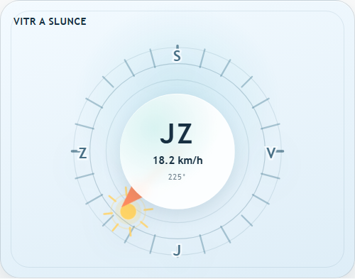
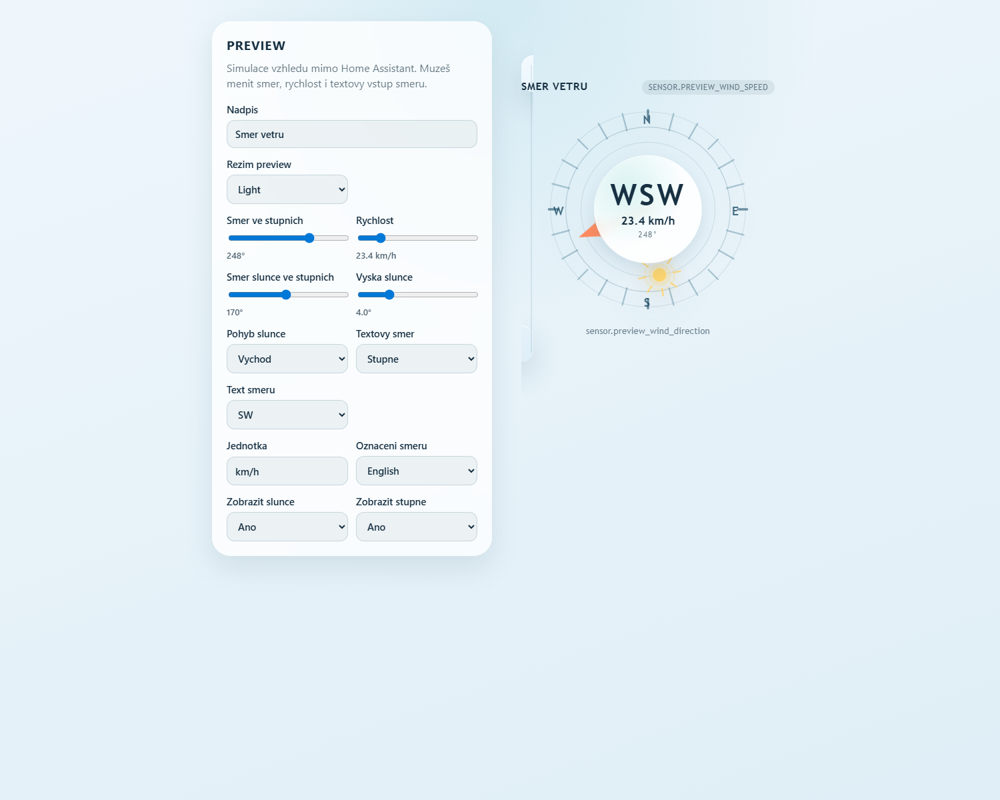
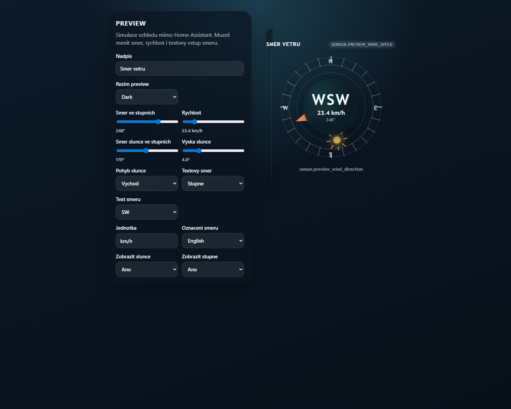

# Compass Card

Compass Card is a Home Assistant Lovelace card that visualizes wind direction and wind speed on a graphical compass, with optional sun position, Czech direction labels, a built-in visual editor, and light/dark theme support.

## Features

- graphical compass with a wind direction arrow
- direction label and wind speed in the center of the card
- Czech and English direction labels
- optional sun position based on `sun.sun.attributes.azimuth`
- optional moon phase and moon position
- sunrise, sunset, and daytime sun animations
- Lovelace visual editor
- automatic light and dark theme support

## Installation

### HACS

1. Open `HACS`.
2. Open the `...` menu in the top-right corner and choose `Custom repositories`.
3. Add `https://github.com/moukas/Compass-Card`.
4. Select `Dashboard` as the repository type.
5. Open the repository in HACS and click `Download`.
6. If HACS does not add the resource automatically, add it manually.

If needed, add the resource manually:

```yaml
url: /hacsfiles/Compass-Card/compass-card.js
type: module
```

### Manual

1. Copy [`compass-card.js`](./compass-card.js) to `config/www/compass-card.js`.
2. Add a dashboard resource in Home Assistant:

```yaml
url: /local/compass-card.js
type: module
```

3. Use the card in your dashboard.

## Preview

The repository includes a standalone preview:

- local preview: [`preview.html`](./preview.html)
- GitHub Pages preview: [`docs/index.html`](./docs/index.html)

## Screenshots

### Home Assistant



### Preview Light



### Preview Dark



## Example Configuration

```yaml
type: custom:compass-card
title: Wind
direction_entity: sensor.wind_direction
speed_entity: sensor.wind_speed
direction_language: cs
show_sun: true
sun_entity: sun.sun
sun_attribute: azimuth
show_moon: true
moon_phase_entity: sensor.moon
observer_entity: zone.home
speed_unit: km/h
speed_decimals: 1
degree_decimals: 0
show_degrees: true
```

## Options

- `direction_entity`: entity with wind direction. Supports degrees and text values such as `N`, `SW`, or `Severovychod`.
- `speed_entity`: entity with wind speed.
- `direction_language`: direction label language. Supports `en` and `cs`.
- `show_sun`: shows the sun position on the compass edge.
- `sun_entity`: entity used for sun position. Default is `sun.sun`.
- `sun_attribute`: attribute containing azimuth degrees. Default is `azimuth`.
- `show_moon`: enables moon phase and optional moon position rendering.
- `moon_phase_entity`: entity with the moon phase state, for example `sensor.moon`.
- `moon_position_entity`: optional entity providing moon position attributes. If omitted, the card computes moon position from the observer coordinates.
- `moon_azimuth_attribute`: attribute containing moon azimuth degrees. Default is `azimuth`.
- `moon_elevation_attribute`: attribute containing moon elevation. Default is `elevation`.
- `observer_entity`: entity with observer coordinates. Default is `zone.home`.
- `observer_latitude`: optional latitude override for moon position computation.
- `observer_longitude`: optional longitude override for moon position computation.
- `title`: optional card title.
- `speed_unit`: optional speed unit override.
- `speed_decimals`: number of decimal places for speed.
- `degree_decimals`: number of decimal places for degrees.
- `show_degrees`: shows the calculated angle in the center of the card.

## Notes

- If the direction is numeric, the card also shows the corresponding 16-point compass label (`N`, `NNE`, `NE`, and so on).
- With `direction_language: cs`, the card uses Czech labels (`S`, `SV`, `V`, `JZ`, and so on).
- If the direction is text-based, the card tries to map it to an angle so the arrow rotates correctly.
- When `show_sun` is enabled, the card renders a separate sun indicator based on azimuth.
- If `sun.sun` provides `elevation` and `rising`, the card adds stronger sunrise and sunset animations.
- When `show_moon` is enabled, the card uses `moon_phase_entity` for the phase and prefers `moon_position_entity` for azimuth/elevation.
- If both are available, `moon_position_entity` has priority over computed observer-based moon position.
- If `moon_position_entity` is missing, the card computes moon azimuth and elevation from `observer_entity` or the latitude/longitude overrides.
- Home Assistant usually provides moon phase through a Moon sensor. The observer coordinates can come directly from `zone.home`.
- If the moon phase is available but observer coordinates are missing too, the card shows the phase label in the center instead of placing the moon on the compass.
- If moon elevation is below the horizon, the moon marker stays visible but dimmed.
- When the entity state is `unavailable` or `unknown`, the card remains rendered and shows that data is missing.
- In light mode the card switches to a light theme; in dark mode it stays dark.
